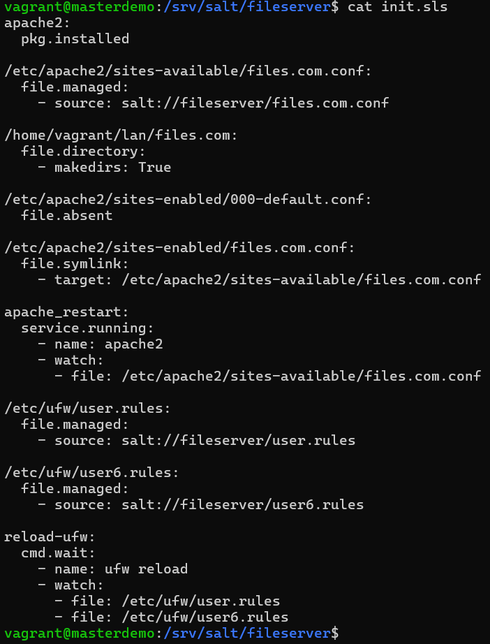

# apache-fileserver
You can make your own fileserver inside private network with this project

## Info
This project allows file sharing to enhance availability of files.

### Instructions
To download project with git, use command: git clone https://github.com/apeeqq/apache-fileserver.git  
or you can download project from githubs interface as ZIP-file.

This projects prerequisites are salt-master and salt-minion(at least one minion) installed to your computers.  
Project has been tested with Debian 12 (bookworm) inside vagrant-machines.  
User of this project has full responsibility for the usage.

After downloading the repository
1. You must run command in your salt-master pc: sudo mkdir -p /srv/salt/fileserver #This makes directory path /srv/salt/fileserver to your computer, if it doesn't already exist
2. Copy **files.com.conf, init.sls, user.rules, user6.rules** files to directory path: /srv/salt/fileserver
3. Run the module with command: sudo salt '*' state.apply fileserver

 
 

Made by Aapo Tavio  
*License: GNU General Public License v3.0. http://www.gnu.org/licenses/gpl.html*
